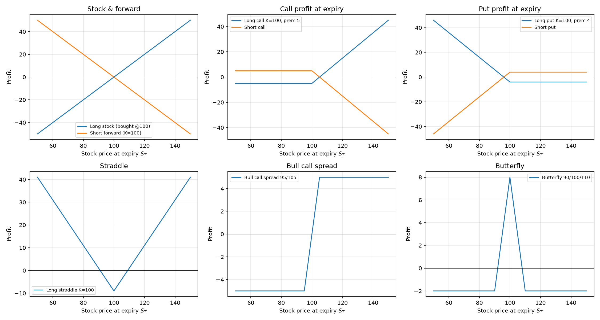
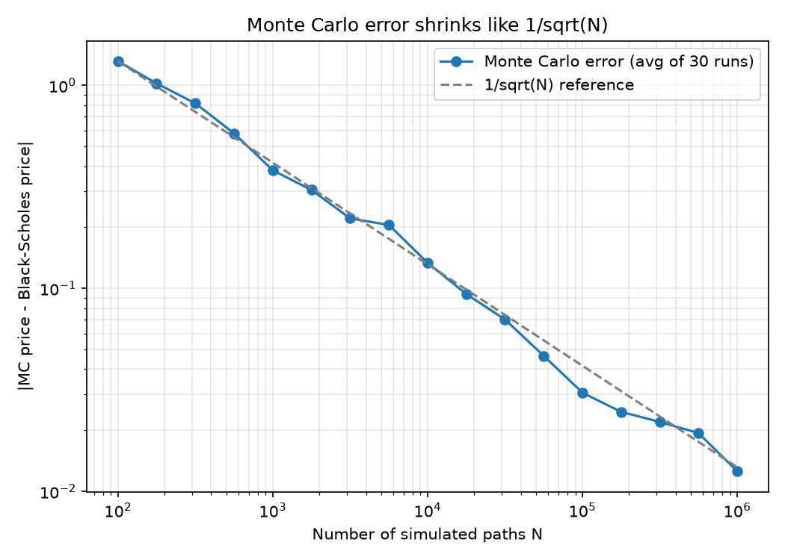
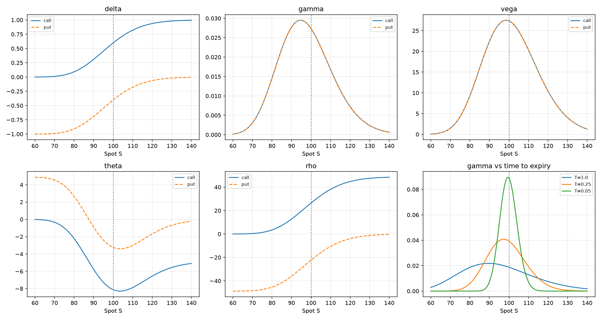
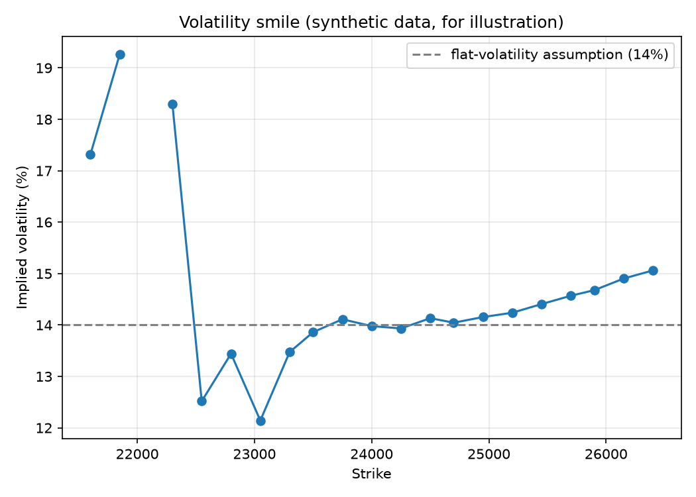

# Options Pricing Model

**Pricing options three ways (formula, simulation, market data) and checking that they agree.**

 

> **Status:** core library complete and tested · validation on real NSE option prices in progress
> *Educational project, not investment advice.*

---

## What this project does

An **option** is a contract whose value depends on where a stock ends up. This project answers three questions about it:

1. **What is the option worth?** I price it with the Black–Scholes formula *and* with a Monte Carlo simulation of thousands of possible futures, then check the two agree.
2. **How does that value react when things change?** I compute the "Greeks" (delta, gamma, vega, theta, rho) three independent ways.
3. **Does the model match the real market?** I compare model prices with traded option prices and measure *where* the model is accurate and where it breaks.

Everything is written in Python (NumPy, SciPy, pandas, Matplotlib) and covered by **125 automated checks**.


## The ideas

**What is an option?**
A *call option* is the right (not the obligation) to buy a stock at a fixed price **K** (the *strike*) on a fixed date **T** (the *expiry*). If the stock ends above K you profit; if it ends below, you simply walk away and lose only what you paid for the option. A *put* is the mirror image: the right to *sell* at K.



**What is Black–Scholes?**
A formula for the fair price of that right *today*. It assumes the stock moves randomly (a "random walk" with a steady upward drift and a constant amount of jitter called **volatility**, σ). Its key insight: you can hedge the option's risk by trading the stock, so the price cannot depend on anyone's opinion about where the stock is heading.

**Why also run a simulation?**
Formulas exist only for simple options. A simulation works for almost *any* payoff, so it is the tool you reach for next. Monte Carlo pricing is simple: simulate many possible futures for the stock, compute the option's payoff in each, average them, and discount back to today. Because the formula exists for the simple case, I can use it as an **answer key to test the simulation**.



The error shrinks like **1/√N**: 100× more simulations gives only 10× more accuracy. That is why the project also implements *variance reduction* tricks (below), which get accuracy without more simulations.

**What are the Greeks?**
Dials that tell you how the option's price responds to the world changing:

| Greek | Plain-English meaning |
|---|---|
| **Delta** | If the stock moves up by 1, how much does the option move? |
| **Gamma** | How quickly does delta itself change? (Biggest near the strike, near expiry.) |
| **Vega** | If volatility rises, how much does the option gain? |
| **Theta** | How much value does the option lose each day just from time passing? |
| **Rho** | How sensitive is it to interest rates? |



---

## Quick start

```bash
git clone https://github.com/hmjag07/Quants.git
cd Quants/Options_Pricing_Model

python -m venv .venv
# Windows (PowerShell):  .venv\Scripts\Activate.ps1
# macOS / Linux:         source .venv/bin/activate

pip install -r requirements.txt
```

Try it:

```bash
python black_scholes.py     # prices an at-the-money call and put
python greeks.py            # Greeks three ways, side by side
python Mc_Engine.py         # speed benchmark + variance-reduction table
python Market_Validation.py # demo on a synthetic option chain
python make_figures.py      # regenerates every image in /images
```

---

## What's inside

All files sit in one folder and import each other.

| File | What it does |
|---|---|
| `payoffs.py` | Payoffs and profit diagrams: stock, forward, call, put, straddle, strangle, bull spread, butterfly |
| `bonds.py` | Discounting, zero-coupon and coupon bond prices, forward pricing, put-call parity check |
| `black_scholes.py` | The closed-form call/put pricer (plus a version with no SciPy, to cross-check the maths) |
| `monte_carlo.py` | Simulates stock paths: a deliberately slow loop version, and a vectorised one |
| `Mc_Engine.py` | Fast Monte Carlo pricer with variance reduction and a speed benchmark |
| `greeks.py` | Delta, gamma, vega, theta, rho: formula, finite-difference, and Monte Carlo |
| `Market_Validation.py` | Implied volatility, calibration, loading real option chains, error by moneyness |
| `explore.py` | Notebook-style cells (run in VS Code) for plotting and experimenting |
| `Make_Figures.py` | Generates the figures in this README |
| `Verify_until_greeks.py` | The automated test suite |

---

## Results you can reproduce

**Black–Scholes benchmark** (stock = strike = 100, rate 5%, volatility 20%, 1 year):

| | Price |
|---|---|
| Call | **10.4506** |
| Put | **5.5735** |

These match a hand calculation, and a textbook example from Hull (S=42, K=40, r=10%, σ=20%, T=0.5 → call 4.76, put 0.81) is built into the tests.

**Greeks for the same call** (analytical, checked against finite differences and Monte Carlo):

| Greek | Value | Read it as |
|---|---|---|
| Delta | 0.6368 | stock +1 → option about +0.64 |
| Gamma | 0.01876 | delta changes by ~0.019 per +1 in stock |
| Vega | 37.52 per 1.00 of vol (0.375 per vol point) | vol +1 percentage point → option about +0.38 |
| Theta | −6.414 per year (≈ −0.018 per day) | the option loses ~0.018 a day to time |
| Rho | 53.23 per 1.00 of rate (0.532 per 1%) | rates +1% → option about +0.53 |

**Monte Carlo accuracy:** the simulated price converges to the formula as shown in the convergence plot. Every simulated price is reported **with its standard error**, because a Monte Carlo number without an error bar is not a finished result.

**Speed:** the vectorised engine is far faster than the loop version. Run `python mc_engine.py` to see the speed-up on your machine; the benchmark prints loop time, vectorised time and the ratio.

<!-- TODO (add after running on real data): a short "Real-market validation" section with
     your data source, date, expiry and the table printed by summarize(). -->

---

## How it works

### 1. The stock model

The stock follows geometric Brownian motion:

$$dS_t = \mu S_t\,dt + \sigma S_t\,dW_t$$

Applying Itô's Lemma to $\ln S$ gives an *exact* solution, so each simulated stock price needs no step-by-step approximation:

$$S_T = S_0 \exp\!\Big[\big(r - \tfrac{1}{2}\sigma^2\big)T + \sigma\sqrt{T}\,Z\Big],\qquad Z\sim N(0,1)$$

(For pricing, the drift $\mu$ is replaced by the risk-free rate $r$. That is *risk-neutral valuation*.)

### 2. Two prices that must agree

**Closed form:**

$$C = S\,N(d_1) - K e^{-rT} N(d_2),\qquad d_1=\frac{\ln(S/K)+(r+\tfrac12\sigma^2)T}{\sigma\sqrt T},\quad d_2=d_1-\sigma\sqrt T$$

**Monte Carlo:**

$$C \approx e^{-rT}\,\frac{1}{N}\sum_{i=1}^{N}\max(S_T^{(i)}-K,\,0),\qquad \text{standard error}=\frac{s}{\sqrt N}$$

### 3. Variance reduction (better accuracy for free)

- **Antithetic variates:** for every random draw, also use its mirror image. The two results partly cancel each other's luck.
- **Control variate:** the stock's *expected* final price is known exactly. Use that known quantity to correct for how lucky or unlucky the simulation was.

Both are implemented in `mc_engine.py`. `python mc_engine.py` prints the standard error for plain, antithetic, control-variate and combined versions side by side.

### 4. The Greeks, three independent ways

| Method | Idea | Why include it |
|---|---|---|
| Closed form | Differentiate the formula by hand | The answer key |
| Finite difference | Nudge an input slightly, reprice, divide | Works for *any* pricer |
| Monte Carlo (pathwise / likelihood-ratio) | Estimate sensitivities from the simulation | Needed when no formula exists |

One detail worth knowing: **gamma needs a different estimator.** A call's payoff has a sharp corner at the strike, so differentiating along each path twice gives zero (wrong). The likelihood-ratio method fixes this by differentiating the probability instead of the payoff.

### 5. Comparing with the real market

Backwards from a market price you can ask: *which volatility would make Black–Scholes match this price?* That is the **implied volatility**, found by root-finding. If Black–Scholes were perfectly right, every strike would give the same implied volatility. In real markets they do not: options far from the current price (especially out-of-the-money puts on indices) typically show **higher** implied volatility, a pattern called the **volatility smile** (or *skew*).



*(The figure above uses a synthetic chain with a smile built in, purely to illustrate the idea. It is not market data.)*

The practical consequence: a single-volatility model fits well **near the money** and badly **in the wings**. So errors are reported **by moneyness bucket**, not as one blended number.

---

## Use your own market data

Download an option chain (for example NSE's option-chain page or F&O bhavcopy) as a CSV. The loader recognises NSE-style column names (`StrkPric`, `OptnTp` with `CE`/`PE`, `ClsPric`) as well as simple `strike, option, market_price` files.

```python
import numpy as np
from market_validation import (load_chain_csv, forward_from_parity,
                               calibrate_flat_vol, validate_chain, summarize)

S = 24000.0        # spot of the underlying on the quote date
r = 0.065          # risk-free rate (annual, decimal) - use a current T-bill yield
T = 30 / 365       # years to expiry

chain = load_chain_csv("my_chain.csv")
F = forward_from_parity(chain, r, T)        # forward implied by the chain itself
q = r - np.log(F / S) / T                   # carry that reproduces that forward
sigma = calibrate_flat_vol(chain, S, r, T, q)

detail = validate_chain(chain, S, r, T, sigma, q)
print(summarize(detail).round(2).to_string(index=False))
```

`summarize` prints mean/median absolute % error and the share of options within 5%, by distance from the forward. Options priced below a minimum premium are excluded, since percentage errors on tiny premiums are meaningless. To download underlying price history for historical volatility, install `yfinance` and run `python market_validation.py --live`.

---

## How it is tested

Three suites (125 checks) print PASS/FAIL per check and exit with an error if anything fails. They test against **independent references**, not just against themselves:

- hand-calculated values and textbook examples
- structural identities: put-call parity, `delta_call − delta_put = 1`, equal gamma and vega for calls and puts
- limiting behaviour: deep in-the-money delta → 1, deep out-of-the-money → 0
- statistical consistency: Monte Carlo within four standard errors of the formula; error ∝ 1/√N
- round trips: price → implied volatility → price recovers the original

---

## What I learned

- **Test your tests.** Three of my own expected values were wrong at first (a butterfly's maximum profit, the exactness of put-call parity in a *finite* sample, and a price filter that correctly removed nothing). The fix each time was to work out *why*, not to loosen a tolerance.
- **A Monte Carlo price needs an error bar.** The number alone says nothing about how much to trust it.
- **Claim performance against a stated baseline.** "X% faster" means nothing without saying "than what".
- **Flat-volatility Black–Scholes fails predictably in the wings.** Reporting error by moneyness is more honest than one blended figure.

---

## Limitations

- European options only (no early exercise); no discrete dividends.
- Constant volatility and constant interest rate: no smile, no stochastic volatility.
- Market validation depends on the quote source, the closing-price timing and the chosen risk-free rate; closing prices of illiquid strikes can be stale.

## Possible extensions

Local-volatility or Heston model fitted to the smile · American options (binomial tree, Longstaff–Schwartz) · path-dependent payoffs (Asian, barrier) using the same engine · delta-hedging simulation.

---

## References

- Black & Scholes (1973), *The Pricing of Options and Corporate Liabilities*, Journal of Political Economy
- Merton (1973), *Theory of Rational Option Pricing*, Bell Journal of Economics
- Hull, *Options, Futures, and Other Derivatives*
- Glasserman (2004), *Monte Carlo Methods in Financial Engineering*
- Cvitanić, *Pricing Options with Mathematical Models* (CaltechX BEM1105x lecture series)

## Author

**Harsh Jagtap**: B.Tech Electrical Engineering, VJTI Mumbai · [GitHub](https://github.com/hmjag07) · [LinkedIn](https://linkedin.com/in/harsh-jagtap-8b186928b)
